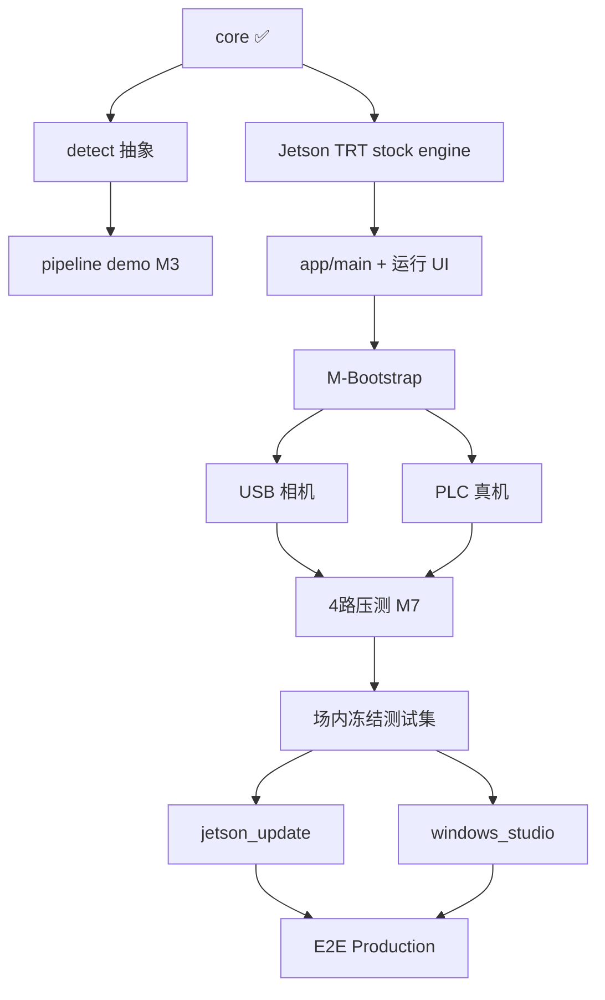

# 安全区入侵检测系统 — 执行方案

> 本文档由《安全区入侵检测系统_设计方案.md》拆解而来，面向研发落地：任务清单、依赖关系、验收标准、风险与前置决策。
>
> **原则（v1.2）**：先 core 后 Jetson；**Bootstrap = COCO stock 模型 + Jetson 完整运行 UI**；场内数据与 `windows_studio` 后置；**冻结测试集仅针对微调模型**（阶段三硬门禁）。
>
> 验证细则见 [validation_phases.md](validation_phases.md)；决策见 [decisions.md](decisions.md)。

---

## 0. 执行总览

### 0.1 目标交付物

| 交付物 | 部署位置 | 说明 |
|--------|----------|------|
| 运行程序 `safetyzone` | **Jetson** | 多路检测 → PLC → 报警录像；**含 PySide6 运行 UI** |
| stock FP16 engine | Jetson `models/stock/` | COCO 预训练 YOLOv8s；Bootstrap 集成验证用 |
| 闭环工具 `windows_studio` | 调试人员 Windows GPU | 阶段三：复核 → 微调 → 下发 ONNX |
| 模型更新服务 `jetson_update` | Jetson | 阶段三：收 ONNX → 编 engine → **场内**冻结集验收 |
| 场内冻结测试集 | Jetson `jetson_update/testset/` | 阶段三；微调模型验收唯一依据 |
| 配置与文档 | 仓库 + 现场 | config 模板、Bootstrap 记录、部署手册 |

**暂不交付：** A100 远端训练、`train_remote`、`baseline_recall` 现场 50 帧报告（Production 前可选）。

### 0.2 三阶段路线

```
阶段一（缩短）        阶段二 Bootstrap + 强化        阶段三 Production
本机 core+detect     Jetson：TRT + 运行 UI 全链路    场内数据 + windows_studio
                     + 视频/USB + PLC 仿真→真机       + jetson_update 验收闸
  │                        │                              │
  ├ core ✅               ├ stock engine (COCO)          ├ 冻结测试集(微调前)
  ├ detect 抽象           ├ ui/ 监视/划区/报警           ├ studio 训练
  └ pipeline demo         ├ M-Bootstrap                  └ E2E 热切换
                          └ 4路/USB/PLC真机/压测
```

### 0.3 关键路径

1. `core/` 判区 + 状态机 + 配置 → 单元测试通过 ✅  
2. `detect/` 抽象 +（本机 onnx 可选）；**Jetson stock ONNX → trtexec FP16**  
3. **`app/main.py` + `ui/` 运行 UI**：视频源 → 划区 → 运行 → 信号/报警（**M-Bootstrap**）  
4. USB 相机、PLC 真机、4 路压测（阶段二后期）  
5. **场内冻结测试集** → 才能对 **微调模型** 做 `acceptance`  
6. windows_studio E2E：难 case → 训练 → 下发 → 验收 → 热切换  

---

## 1. 启动前：待确认项

| # | 决策项 | 已定 / 默认 | 文档 |
|---|--------|-------------|------|
| D1 | 检测模式 | 仅 person | decisions.md |
| D2 | 视频 + USB | 视频优先 Bootstrap | decisions.md |
| D3 | PLC S7-1200/1500 | 已选 | decisions.md |
| D4 | 录像 | 快照+短片段 | decisions.md |
| D5 | 召回验收阈值 | 阶段三前共定 | — |
| D6 | 标注工具 | 自建 studio | — |
| D7 | 网络/rsync | 阶段三前 | — |
| D8 | 训练算力 | **无 A100；Win GPU 本机** | decisions.md |
| D9 | 验证策略 | **Bootstrap UI / Production 冻结集** | validation_phases.md |
| D10 | COCO 边界 | 仅集成验证 | decisions.md |
| D11 | PLC Bootstrap | **仿真可先，真机分步** | decisions.md |

### 1.1 环境拓扑（当前）

```
┌──────────────────────── 现场局域网 ────────────────────────┐
│                                                            │
│  ┌──────────────── Jetson 现场机 ─────────────────────┐  │
│  │  运行 UI (PySide6)  ← Bootstrap 验证主体            │  │
│  │  检测 → 判区 → FSM → PLC(仿真/真机) → 录像          │  │
│  │  stock yolov8s.engine (COCO 预训练)                  │  │
│  │  outbox / inbox（阶段三）                             │  │
│  └────────────────────────▲─────────────────────────────┘  │
│                           │ rsync ONNX（阶段三）            │
│  ┌────────────────────────┴─────────────────────────────┐  │
│  │  调试人员 Windows GPU                                 │  │
│  │  windows_studio：复核 / 训练 / 下发                   │  │
│  └──────────────────────────────────────────────────────┘  │
└────────────────────────────────────────────────────────────┘

研发本机（无 GPU 可）：core / detect 接口 / pytest / Git
```

**两套 UI：** Jetson = **运行 UI**（监视、划区）；Windows = **studio**（训练）。见 decisions.md。

---

## 2. 环境与仓库准备

### 2.1 仓库骨架

见设计方案 §9。阶段一已完成：core、tests、configs、camera 抽象。

### 2.2 开发机分工

| 机器 | 使用者 | 用途 |
|------|--------|------|
| **本机**（Win，无 GPU 可） | 研发 | core、detect 接口、pytest、文档 |
| **Jetson Orin Nano Super** | 研发 + 现场 | **Bootstrap 主战场**：TRT、**运行 UI**、视频/USB、PLC |
| **调试人员 Windows GPU** | 现场调试 | 阶段三 `windows_studio`；Bootstrap 期可不参与 |

**Jetson 环境检查（Bootstrap Day 0）**

```bash
python3 --version    # ≥3.10
nvidia-smi
dpkg -l | grep nvidia-jetpack
pip install ultralytics opencv-python PySide6 python-snap7
yolo export model=yolov8s.pt format=onnx imgsz=640 opset=18 simplify=True dynamic=False
trtexec --onnx=yolov8s.onnx --saveEngine=models/stock/yolov8s.engine --fp16
```

---

## 3. 阶段一：离线核心（约 1–2 周，本机）

**目标**：平台无关 core 正确；detect 抽象就绪。**不以现场图基线为阻塞。**

### 3.1 Sprint 1.1 — `core/` ✅

| 模块 | 状态 |
|------|------|
| config / zone / fsm / postprocess / tracking | ✅ 已完成 |
| anomaly | ⏭ D1 跳过 |

**验收**：`pytest tests/core/` 全绿；core 无 cv2/TRT/snap7。

### 3.2 Sprint 1.2 — 推理抽象（本机，可与 Jetson Bootstrap 并行）

| 任务 | 说明 |
|------|------|
| `detect/backend.py` | `load` / `infer` / `warmup` / `switch_engine`(stub) |
| `detect/onnx_backend.py` | Letterbox + ONNXRuntime + `core/postprocess`（本机 CPU 对照） |
| `tools/export_onnx.sh` | 文档化；**实际 export 在 Jetson 执行** |
| ~~`tools/baseline_recall.py`（现场 50 帧）~~ | **延后至 Production**；Bootstrap 可选 `tools/coco_smoke.py` |

**验收**：本机可对单张图 infer；不阻塞 M-Bootstrap。

### 3.3 Sprint 1.3 — 编排骨架

| 任务 | 说明 |
|------|------|
| `app/pipeline.py` | 取帧 → 推理 → 判区 → FSM → 信号 |
| `app/events.py` | 帧 / 检测 / 入侵 / 故障 |
| `app/demo.py` | `--images` 或 `--video` CLI（无 UI 的自动化回归） |

**验收 **M3**：CLI 输出信号序列与 FSM 单测一致。

### 3.4 阶段一里程碑

| 里程碑 | 完成定义 |
|--------|----------|
| **M1** | ✅ core 单测 + config 可加载 |
| **M3** | 离线 pipeline demo / CLI |

**M2 移至 Jetson Bootstrap**（见 §4.0）。

---

## 4. 阶段二：Jetson Bootstrap + 运行侧强化（约 3–5 周）

**目标**：Jetson 上 **完整运行 UI** 可走通；stock 模型；再扩展 USB / PLC 真机 / 4 路压测。

### 4.0 Sprint B — Jetson Bootstrap（优先，Week 1–2）

> **本 Sprint 为当前重点。** 验证主体是 **运行 UI + 全流水线**，不是 CLI YOLO。

| 顺序 | 任务 | 说明 |
|------|------|------|
| B1 | `detect/trt_backend.py` | FP16；接 core 后处理 |
| B2 | stock engine | COCO yolov8s；见 validation_phases.md §1.4 |
| B3 | `app/main.py` 骨架 | 推理线程 + 视频源；**检测不在 UI 线程** |
| B4 | **`ui/` 最小可交付** | 预览、划区、运行/停、信号/报警、config 保存 |
| B5 | `camera/video_file.py` 接入 UI | D2；Bootstrap **首选输入** |
| B6 | PLC **仿真** | UI 显示拟写入 INT16；D11 |
| B7 | UI 标识 | 「STOCK · 集成测试 · 未过场内验收」 |
| B8 | （建议）`record/` 快照 | STOP 边沿落盘 |

**Bootstrap UI 验收清单：** 见 [validation_phases.md §1.3](validation_phases.md)。

| 里程碑 | 完成定义 |
|--------|----------|
| **M2** | Jetson stock FP16 engine 推理 OK |
| **M-Bootstrap** | **运行 UI 端到端**（视频 → 划区 → 报警/信号） |

### 4.1 Sprint 2.1 — TensorRT 性能

| 任务 | 说明 |
|------|------|
| 热切换骨架 | 加载 → warmup → 原子替换（单帧中途不切） |
| FPS / tegrastats | 单路基准；≥2 路降频策略 |

**验收 **M4**：性能数据写入 `docs/benchmarks/`。

### 4.2 Sprint 2.2 — 相机（USB）

| 任务 | 说明 |
|------|------|
| `camera/v4l2_usb.py` | GStreamer/V4L2；`.copy()`；Watchdog |
| UI 源选择 | USB 与 video_file 可切换 |

**验收**：USB 接入后 UI 预览正常（可在 M-Bootstrap 之后）。

### 4.3 Sprint 2.3 — PLC 真机

| 任务 | 说明 |
|------|------|
| `plc/gateway.py` + 独立进程 | snap7；S7-1200/1500 |
| 仿真 → 真机切换 | config `plc.enabled` / `plc.simulate` |

**验收 **M5**：真机信号 0/1/2/-1 与设计方案 §6.3、§6.4 一致。

### 4.4 Sprint 2.4 — 录像完善

| 任务 | 说明 |
|------|------|
| 环形预录 + 短片段 + 保留策略 | D4 |
| 4 路偶发报警 CPU 评估 | |

### 4.5 Sprint 2.5 — 运行 UI 增强（非「首次做 UI」）

| 模块 | 说明 |
|------|------|
| 监视网格 2×2 | 多路预览 |
| 参数组 UI | 召回组/精度组；召回组改动的二次确认 |
| PLC 配置窗 | IP、模式、看门狗 |
| UI 假死测试 | 拖窗口时检测/PLC 周期仍稳定 |

> Sprint B 已交付 UI 最小集；本节为增强，与 4 路/USB 同步推进。

### 4.6 Sprint 2.6 — 整机集成与压测

| 任务 | 说明 |
|------|------|
| 多工位 | 同相机推理一次、多工位分发 |
| 4 路压测 | 30–60min；tegrastats |
| 难 case → `outbox/` | 为阶段三备料 |
| 阈值整定 | 精度组压误检；召回组谨慎 |

| 里程碑 | 完成定义 |
|--------|----------|
| **M6** | 4 路压测报告 |
| **M7** | 运行 UI 可交付现场（含多路、真机 PLC） |

**阶段二不做**：jetson_update 验收闸、windows_studio 完整流程。

---

## 5. 阶段三：Production 闭环（约 3–4 周）

**硬前置**：**场内冻结测试集** — 针对 **微调模型** 上线；stock 模型 Bootstrap 不要求。

### 5.0 冻结测试集

| 步骤 | 说明 |
|------|------|
| 选帧 | 场内真实场景；≥100–200 张起 |
| 标注 | person；宁可多标、勿漏标 |
| 锁定 | `jetson_update/testset/` + MANIFEST |

### 5.1 `jetson_update/`

receiver → build_engine → **acceptance（场内冻结集 ≥ D5）** → hotswap / rollback。

### 5.2 `windows_studio/`（仅 Win GPU，D8）

| 模块 | 说明 |
|------|------|
| ingest / review_ui / dataset / train | **仅 LocalCudaBackend** |
| export_send | ONNX → Jetson inbox |
| ~~remote_ssh / A100~~ | **不实施** |

**验收 **M10**：调试人员无 CLI 完成拉取 → 复核 → 训练 → 下发。

### 5.3 阶段三里程碑

| 里程碑 | 定义 |
|--------|------|
| **M8** | 场内冻结集锁定 |
| **M9** | acceptance 生效 |
| **M10** | windows_studio 可用 |
| **M11** | E2E + 回滚演练 |

---

## 6. 任务依赖图



---

## 7. 质量门禁

| 门禁 | 阶段 | 要求 |
|------|------|------|
| core 单测 | 一+ | pytest |
| 无 UI 线程 IO | Bootstrap+ | code review |
| Bootstrap UI 标识 | Bootstrap | 须显示 STOCK/集成测试 |
| 帧 copy | 二+ | 相机路径 review |
| engine 不跨机 | 二+ | 仅 ONNX 传输 |
| 微调模型必验收 | 三+ | 冻结集 + acceptance |
| 勿将 COCO 当安全验收 | 全程 | 文档 + UI 纪律 |

---

## 8. 风险与缓解

| 风险 | 缓解 |
|------|------|
| COCO 与现场域差距大 | Bootstrap 后必须场内微调 + Production 验收 |
| 误把 Bootstrap 当正式上岗 | UI/文档双标识；design §2 安全定位 |
| Jetson 无 NVENC | D4 快照+短片段 |
| FP16 精度 | 微调模型验收只在 Jetson FP16 engine |
| 冻结集污染 | MANIFEST + overlap 校验 |
| PLC 未到货 | D11 仿真先验 UI |
| 8GB OOM | 降 FPS；engine 单例 |

~~A100 / train_remote 相关风险~~ — 已移除。

---

## 9. 建议人力与工期

| 角色 | 职责 |
|------|------|
| 研发 | core、detect、**Jetson 运行 UI**、Bootstrap |
| 嵌入式 | TRT、相机、Jetson 部署 |
| 工控 | PLC 真机 |
| 调试人员 | 阶段三 studio；Bootstrap 可协助划区/拍视频 |
| 现场 | 划区、冻结集标注、D5 |

| 阶段 | 日历（1 全职） | 说明 |
|------|----------------|------|
| 阶段一 | 1–2 周 | 本机；Sprint 1.1 ✅ |
| 阶段二 | 3–5 周 | **M-Bootstrap 优先** |
| 阶段三 | 3–4 周 | 依赖 M7 + 场内冻结集 |

---

## 10. 当前行动清单

1. [x] Sprint 1.1 core ✅  
2. [ ] Sprint 1.2 `detect/backend` + `onnx_backend`（本机）  
3. [ ] Jetson：stock export + trtexec  
4. [ ] **`ui/` + `app/main.py` → M-Bootstrap**（视频源 + 划区 + 报警）  
5. [ ] PLC 仿真模式（D11）  
6. [ ] 准备含人 `demo.mp4`  
7. [ ] 记录 `docs/benchmarks/jetson_bootstrap_*.md`  
8. [ ] USB / PLC 真机 / 4 路（M-Bootstrap 之后）  
9. [ ] 阶段三前：场内冻结集 + studio  

---

## 11. 与设计方案章节对照

| 设计方案 | 执行方案 |
|----------|----------|
| §6.7 运行 UI | §4.0 Sprint B（**提前**） |
| §8.5 冷启动 | COCO stock + Bootstrap UI；见 validation_phases |
| §8.4 冻结集 | §5.0（微调模型前） |
| §10 路线 | §0.2、§3–5 |
| §12 待确认 | decisions.md D9–D11 |

---

*文档版本：v1.2 | 变更：COCO Bootstrap + Jetson 完整运行 UI；移除 A100；冻结集仅 Production；PLC 仿真 | 详见 validation_phases.md*
