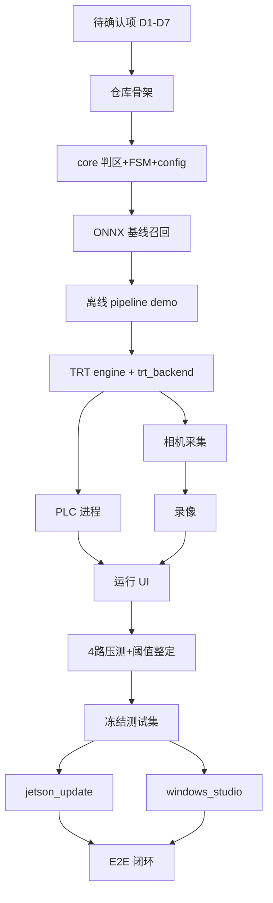

# 安全区入侵检测系统 — 执行方案

> 本文档由《安全区入侵检测系统_设计方案.md》拆解而来，面向研发落地：任务清单、依赖关系、验收标准、风险与前置决策。
> **原则**：先 core 后适配器；先离线验证后 Jetson 真机；先运行稳定后训练闭环；冻结测试集是阶段三硬门禁。

---

## 0. 执行总览

### 0.1 目标交付物

| 交付物 | 部署位置 | 说明 |
|--------|----------|------|
| 运行程序 `safetyzone` | Jetson Orin Nano Super | 多路检测 → PLC 联动 → 报警录像 |
| 模型更新服务 `jetson_update` | Jetson | ONNX 接收 → 编 engine → 召回验收 → 热切换/回滚 |
| 闭环工具 `windows_studio` | 调试人员 Windows GPU 机 | 难 case 拉取 + 复核标注 + 触发训练 + 下发 ONNX |
| 训练算力（可选远端） | A100 服务器（SSH） | 研发调试 + 可选承接 studio 提交的微调任务 |
| 冻结测试集 | Jetson `jetson_update/testset/` | 带标注、永不进训练、验收唯一依据 |
| 配置与文档 | 仓库 + 现场 | `config.json` 模板、部署手册、调参手册 |

### 0.2 三阶段路线（与设计方案 §10 对齐）

```
阶段一 ──▶ 阶段二 ──▶ 阶段三
离线核心     Jetson 运行侧     现场训练闭环
(任意机)     (真机联调)        (稳定后启动)
  │              │                  │
  ├ core+tests   ├ TRT+相机+PLC     ├ 冻结测试集(硬前置)
  ├ ONNX 基线    ├ UI+录像+压测     ├ jetson_update
  └ 召回基线     └ 阈值整定         └ windows_studio + E2E
```

### 0.3 关键路径（不可并行跳过的顺序）

1. `core/` 判区 + 状态机 + 配置 → 单元测试通过  
2. ONNX 基线召回（onnxruntime）→ 确认模型/阈值方向  
3. Jetson 上 `trtexec` 编 FP16 engine → FPS/内存实测  
4. 相机 + PLC 真机联调 → 信号语义 `-1/0/1/2` 与 PLC 程序对齐  
5. **冻结测试集建立并锁定** → 才能做 `acceptance` 与任何模型上线  
6. 端到端闭环：难 case → 训练 → 下发 → 验收 → 热切换  

---

## 1. 启动前：待确认项（阻塞级）

设计方案 §12 中的判断需在**编码前或阶段边界前**定案，否则返工成本高。

| # | 决策项 | 选项 | 建议默认 | 影响范围 | 截止 |
|---|--------|------|----------|----------|------|
| D1 | 检测模式范围 | 仅 person / +object / +anomaly | 先 **person**，object/anomaly 按需加 | core 模式分支、UI 示教、训练类别 | 阶段一启动 |
| D2 | 相机类型 | USB(V4L2) / Orbbec RGB / Orbbec RGB-D | **USB 或 Orbbec 仅 RGB** | `camera/` 适配器优先级 | 阶段二启动 |
| D3 | PLC 型号与协议 | S7-1200/1500 + block/command 模式 | 现场确认 IP、rack/slot、变量表 | `plc/` 全模块 | 阶段二启动 |
| D4 | 录像策略 | 快照+短片段(默认) / 软编 x264 / 长时连续录 | **快照+短片段** | `record/`、CPU 负载 | 阶段二启动 |
| D5 | 召回率验收阈值 | 例：冻结测试集 person 召回 ≥ X% | **与现场+安全负责人共定** | `acceptance`、能否上线 | **阶段三开始前** |
| D6 | 标注工具 | 自建 review_ui / 通用底座 | 自建（预标注+复核） | `windows_studio` 工作量 | 阶段三启动 |
| D7 | 网络拓扑 | Jetson↔Windows 静态 IP、rsync 路径 | 文档化 IP 与目录 | 下发/拉取脚本 | 阶段三启动 |
| D8 | 训练算力位置 | 仅调试人员 Win GPU / Win+厂内 A100 / A100 在厂外 | 见 **§1.1** | 数据合规、`train` 模块形态 | 阶段三启动 |

**输出物**：`docs/decisions.md`（一页决策记录，含日期与签字/确认人）。

### 1.1 实际环境拓扑（研发 A100 + 现场 Windows）

> **现状**：研发侧无本地 GPU Windows，有 **A100 服务器（SSH）**；现场 **调试人员有 GPU Windows 机**。
> 与设计方案「Windows 工作台」不矛盾——**复核 UI 必须在调试人员本机**；**训练可本地或远端**，由 D8 定案。

```
                    ┌──────────── 现场局域网（数据不出厂） ────────────┐
                    │                                                  │
  ┌─────────────────┴──────────────┐         ┌───────────────────────┴────────┐
  │ 调试人员 Windows GPU            │         │  Jetson 现场机                      │
  │  windows_studio（PySide6）      │◀─rsync──│  检测 → PLC → outbox / inbox       │
  │  · 拉取难 case                   │         └────────────────────────────────────┘
  │  · 复核/改框/补标（主 UX）        │
  │  · 数据集管理 + 触发训练          │
  │  · 收 ONNX → 下发 Jetson         │
  └───────────┬──────────────────────┘
              │ 训练任务（二选一，D8）
              ├─(A) 本机 Ultralytics CUDA 微调  ← 数据量小、Win GPU 够用
              └─(B) rsync 数据集 → A100 SSH 训练 → rsync 回 best.pt/onnx
                    │
  ┌─────────────────┴──────────────┐
  │ A100 服务器（研发 SSH）         │  ← 阶段一基线、阶段三可选训练后端
  │  · 研发：core 验证、ONNX 基线    │
  │  · 可选：承接 studio 远程 train  │
  │  · 导出 ONNX（研发自测路径）     │
  └────────────────────────────────┘
```

**推荐分工（默认 D8 = Win 复核 + A100 训练）**

| 角色 | 机器 | 做什么 | 不做什么 |
|------|------|--------|----------|
| **研发（你）** | A100（SSH）+ 任意机 | 阶段一 core/tests；ONNX 基线；`train_remote` 脚本；jetson 侧代码 | 不依赖本地 Win GPU |
| **调试人员** | 现场 Windows GPU | `windows_studio` 复核 UI；拉取 outbox；点「训练」；下发 ONNX | 不必手敲 SSH（UI 封装） |
| **现场** | Jetson | 运行检测；收 ONNX；编 engine；召回验收 | 不训练 |

**数据合规（设计方案「数据不出厂」）**

| A100 位置 | 是否可用于**现场生产数据**微调 | 说明 |
|-----------|-------------------------------|------|
| **厂内网 / 专线 VPN 进厂** | ✅ 可以 | 与 Jetson、Windows 同安全域；推荐 D8 方案 B |
| **厂外云/机房** | ⚠️ 仅研发 | 可用公开数据或脱敏样例做算法开发；**现场难 case 不应 rsync 出厂** |
| **不确定** | 先当厂外 | 阶段三闭环默认 **Win 本机训练**；A100 只做研发基线 |

**对实现的影响（`windows_studio/train`）**

- 抽象 **`TrainBackend`**：`LocalCudaBackend`（Win 本机）与 `RemoteSshBackend`（rsync → SSH `yolo train` → 拉回）。
- studio 向导第 3 步「训练」：下拉或配置选 backend；进度条读本地 log 或远端 tail。
- 研发在 A100 上维护 `tools/train_remote.sh`（或 `windows_studio/train_remote.py`）与 conda/venv 版本锁，避免 Ultralytics 版本漂移。

---

## 2. 环境与仓库准备（第 0 周）

### 2.1 仓库骨架（Day 1–2）

按设计方案 §9 创建目录与最小可运行包结构：

```
safetyzone/
├── pyproject.toml          # 或 requirements.txt + 可选 uv/poetry
├── README.md               # 克隆、安装、阶段一如何跑 tests
├── core/
├── detect/
├── camera/
├── plc/
├── record/
├── ui/
├── app/
├── jetson_update/
├── windows_studio/
├── tools/
├── tests/
└── configs/
    └── config.example.json
```

**任务清单**

- [ ] 初始化 Python 包（建议 3.10+），分 `runtime` / `dev` / `jetson` / `windows` 依赖组
- [ ] 配置 pytest、`ruff`/`black`（可选）、pre-commit（可选）
- [ ] 添加 `.gitignore`（`*.engine`、`*.onnx` 大文件、`outbox/`、`inbox/`、录像目录）
- [ ] `config.example.json`：stations / cameras / param_groups / plc 字段与设计方案 §6.6 一致

**验收**：`pytest tests/` 可运行（即使仅 1 个占位测试）；`pip install -e .` 成功。

### 2.2 开发机分工（按实际环境）

| 机器 | 使用者 | 用途 | 必备软件 |
|------|--------|------|----------|
| **A100 服务器（SSH）** | 研发 | 阶段一 ONNX 基线/召回扫描；Ultralytics 微调实验；可选 studio 远程训练后端 | Linux、CUDA、Python 3.10+、Ultralytics、onnxruntime-gpu、pytest |
| 任意机（无 GPU 亦可） | 研发 | 阶段一 `core/` 开发与单测；Git；SSH 客户端 | Python 3.10+、pytest、numpy |
| **调试人员 Windows GPU** | 现场调试 | 阶段三 `windows_studio` 复核 UI；本机训练（D8-A）或触发远端训练（D8-B）；ONNX 下发 Jetson | CUDA、Ultralytics、PySide6、rsync 或 WinSCP |
| Jetson Orin Nano Super | 现场 | 阶段二起运行侧 + inbox/outbox | JetPack 6.x、TensorRT、GStreamer OpenCV、python-snap7、PySide6 |

**研发阶段一启动条件**：已有 A100 SSH 即可，**不阻塞**于 Windows GPU。

**A100 首次环境检查（研发自测，Day 0）**

```bash
# SSH 登录后
python3 --version          # ≥3.10
nvidia-smi                 # 确认 A100 可见
pip install ultralytics onnxruntime-gpu pytest opencv-python-headless
yolo export model=yolov8s.pt format=onnx imgsz=640 opset=18 simplify=True dynamic=False
```

---

## 3. 阶段一：离线核心与基线（约 2–3 周）

**目标**：在不依赖 Jetson/PLC/相机的前提下，证明「判区 + 状态机 + 后处理」正确，并量化 YOLOv8s 在真实帧上的召回基线。

### 3.1 Sprint 1.1 — `core/` 平台无关层（Week 1）

| 模块 | 文件（建议） | 功能要点 | 测试 |
|------|--------------|----------|------|
| 配置模型 | `core/config.py` | 加载/校验/归一化 `config.json`；原子写、备份 | 损坏回退、工位唯一性 |
| 判区几何 | `core/zone.py` | 多边形缩放、锚点命中、重叠面积比、STOP>SLOW 优先级 | 边界用例、嵌套区 |
| 入侵状态机 | `core/fsm.py` | EnterFrames/ExitFrames、slow/stop 双通道、信号 2/1/0/-1 | 帧序列表驱动测试 |
| 后处理 | `core/postprocess.py` | YOLO 输出解析、NMS、conf/尺寸过滤 | 固定 tensor 快照 |
| 跟踪（可选 v1） | `core/tracking.py` | 简单 IOU 跟踪或先跳过，HoldMs 用上一帧框 | 漏检保持 |
| 异常差分 | `core/anomaly.py` | 背景差分 blob → 锚点（若 D1 含 anomaly） | 合成帧 |

**验收标准**

- [ ] `pytest tests/core/` 覆盖率以**行为验收**为主：FSM 全转移、判区嵌套优先级、配置校验失败路径
- [ ] **零** `cv2`/TensorRT/snap7  import 出现在 `core/`（纯 numpy + 标准库）

### 3.2 Sprint 1.2 — 推理抽象与 ONNX 基线（Week 2）

| 任务 | 说明 |
|------|------|
| `detect/backend.py` | 抽象接口：`load` / `infer` / `warmup` / `switch_engine`（后两者可先 stub） |
| `detect/onnx_backend.py` | Letterbox、ONNXRuntime 推理、接 `core/postprocess` |
| `tools/export_onnx.sh` | `yolo export model=yolov8s.pt format=onnx imgsz=640 opset=18 simplify=True dynamic=False` |
| `tools/baseline_recall.py` | 对一小批**真实现场帧**（带人工 GT 框）算 person 召回、误检率（**在 A100 或 CPU 上跑**） |

**召回组默认参数（保守侧，可写入 `param_groups` 模板）**

- conf：偏低（如 0.25–0.35，以基线脚本扫一遍选）
- EnterFrames：小（如 2–3）
- ExitFrames：大（如 8–15）
- HoldMs：大（如 300–500ms @ 实际检测帧率）
- MinOverlap：低（如 0.05–0.15）
- 安全区多边形：相对 UI 标注外扩 margin

**验收标准**

- [ ] 在开发机上对 ≥50 张真实帧输出召回率/误检率报告（Markdown 或 CSV）
- [ ] 单帧端到端延迟可测（onnxruntime，仅作参考，不等于 Jetson TRT）

### 3.3 Sprint 1.3 — 编排骨架（Week 2–3）

| 任务 | 说明 |
|------|------|
| `app/pipeline.py` | 单相机单工位逻辑：取帧 → 推理 → 判区 → FSM → 输出信号（无真实 IO） |
| `app/events.py` | 统一事件类型：帧、检测、入侵、故障 |
| 假数据源 | `tests/fixtures/` 或读图片目录模拟相机 |

**验收标准**

- [ ] CLI 或脚本：`python -m app.demo --config configs/config.example.json --images dir/` 输出每帧信号序列，与预期 FSM 一致
- [ ] 同相机多工位：**推理一次、多工位分发** 结构就位（可先单工位跑通再扩展）

### 3.4 阶段一里程碑

| 里程碑 | 完成定义 |
|--------|----------|
| **M1** | core 单元测试全绿，配置样例可加载 |
| **M2** | ONNX 基线召回报告完成，召回组参数有初值 |
| **M3** | 离线 pipeline demo 可复现入侵信号序列 |

**阶段一不做**：PySide6 完整 UI、PLC、TensorRT、录像、windows_studio。

---

## 4. 阶段二：Jetson 运行侧（约 3–5 周，硬件到货后）

**目标**：Jetson 上 4 路以内稳定运行，PLC 联动与报警录像可用，完成压测与阈值整定。

### 4.1 Sprint 2.1 — TensorRT 与性能（Week 1）

| 任务 | 命令/要点 |
|------|-----------|
| 本机编 engine | `trtexec --onnx=model.onnx --saveEngine=model.engine --fp16` |
| `detect/trt_backend.py` | FP16 默认；输出接 core 后处理 |
| 热切换骨架 | 加载新 engine → warmup N 帧 → 原子替换（单帧中途不切） |
| FPS 基准 | 1/2/4 路检测帧率、`tegrastats` 内存/温度 |

**验收标准**

- [ ] 单路 FP16 推理达到设计方案预期（留实测数据表：FPS、CPU%、GPU%、内存 MB）
- [ ] ≥2 路时降频策略生效（配置项：`max_detect_fps_per_cam` 或全局 quota）

### 4.2 Sprint 2.2 — 相机采集（Week 1–2）

| 任务 | 说明 |
|------|------|
| `camera/base.py` | `CameraStream`：start/stop、get_frame、连接事件 |
| `camera/v4l2_usb.py` | GStreamer/V4L2；最新帧队列；**`.copy()`** |
| `camera/orbbec.py` | 若 D2 选 Orbbec：pyorbbecsdk RGB |
| 双目拆分 | 宽高比识别左右 ROI（若现场有双目 USB） |
| Watchdog | 断线重连、指数退避 |

**验收标准**

- [ ] 4 路同时拉流 30min 无内存泄漏（帧队列不无限增长）
- [ ] 人为拔插 USB 可自动恢复

### 4.3 Sprint 2.3 — PLC 通信（Week 2–3）

| 任务 | 说明 |
|------|------|
| `plc/gateway.py` | 单连接、串行化、auto_reconnect |
| `plc/process_main.py` | **独立进程** + 队列与主进程通信 |
| `plc/proto_block.py` / `proto_command.py` | 按 D3 二选一先实现，另一 stub |
| `plc/result_writer.py` | INT16 语义 0/1/2/-1/3；写后读回校验 |
| 看门狗 | 轮询超时、连续读失败 → OFFLINE·HOLD 行为可配置 |

**验收标准**

- [ ] 与 PLC 仿真或真机：信号 2/1/0/-1 与设计方案 §6.3、§6.4 一致
- [ ] PLC 进程崩溃后主进程检测并告警，不拖死 UI

### 4.4 Sprint 2.4 — 录像（Week 3）

| 任务 | 说明 |
|------|------|
| `record/buffer.py` | 环形预录缓冲（按工位） |
| `record/event_recorder.py` | 报警边沿触发：快照 + 短片段（默认） |
| 可选软编 | GStreamer x264enc 低优先级线程 |
| 保留策略 | 按天数 / 最小磁盘 / 最大占用清理 |

**验收标准**

- [ ] STOP 边沿触发后磁盘存在快照 + 配置时长内片段
- [ ] 4 路同时偶发报警时 CPU 仍可控（或明确降频策略）

### 4.5 Sprint 2.5 — 运行 UI（Week 3–4）

| 模块 | 功能 |
|------|------|
| 监视网格 | 2×2、~15FPS 预览 |
| 划区编辑 | slow/stop 多边形、参考分辨率 |
| 参数组 | 召回组/精度组分开展示，召回组需权限或二次确认 |
| anomaly 示教 | 若启用 D1 anomaly |
| PLC 配置窗 | IP、协议模式、看门狗 |
| 线程纪律 | 检测/IO 不在 UI 线程；Qt 信号槽回 UI |

**验收标准**

- [ ] 现场人员可完成：绑相机 → 划区 → 保存 config → 运行 → 看到报警状态
- [ ] UI 卡顿不影响检测线程（UI 假死测试：拖动窗口时 PLC 周期仍稳定）

### 4.6 Sprint 2.6 — 整机集成与压测（Week 4–5）

| 任务 | 说明 |
|------|------|
| `app/main.py` | 拉起相机线程、推理线程、PLC 进程、录像线程、UI |
| 多工位 | 同相机多工位、嵌套 STOP/SLOW |
| 压测 | 4 路 + 检测降频 + `tegrastats` 30–60min |
| 阈值整定 | 召回组固定后，精度组（NMS、尺寸门控）压误检 |
| 难 case 采集 | 低置信/近区/疑似漏检 → `outbox/`（为阶段三做准备） |

**验收标准**

| 里程碑 | 完成定义 |
|--------|----------|
| **M4** | Jetson 单路 TRT 性能达标 |
| **M5** | PLC 联调通过，产线可收到 SLOW/STOP |
| **M6** | 4 路压测报告（FPS、温度、内存、报警延迟） |
| **M7** | 运行 UI 可交付现场调试 |

**阶段二不做**：模型验收闸、windows_studio 完整流程（可采集 outbox）。

---

## 5. 阶段三：现场训练闭环（约 3–4 周，运行稳定后）

**硬前置**：**冻结测试集**必须先于 `acceptance` 任何代码上线。

### 5.0 Sprint 3.0 — 冻结测试集（Week 0，必须先做）

| 步骤 | 说明 |
|------|------|
| 选帧 | 覆盖光照/角度/遮挡/多人/边界站位；≥N 张（建议起步 100–200，随现场增） |
| 人工标注 | person 框；纪律：**宁可多标、勿漏标** |
| 锁定 | 拷贝至 `jetson_update/testset/` + 校验 checksum 清单 |
| 文档 | 版本号、日期、标注人；**禁止**拷贝进训练目录的 team 规矩 |
| 基线 | 当前 engine 在冻结集上召回率 → 作为 D5 阈值讨论依据 |

**验收标准**

- [ ] `testset/MANIFEST.json`（帧列表 + 标注路径 + sha256）
- [ ] 训练脚本强制校验：训练集与 testset 零重叠，否则拒绝

### 5.1 Sprint 3.1 — Jetson 模型接收（Week 1–2）

| 模块 | 功能 |
|------|------|
| `jetson_update/receiver.py` | 监听 inbox（rsync/inotify） |
| `jetson_update/build_engine.py` | trtexec FP16 |
| `jetson_update/acceptance.py` | 冻结测试集召回 ≥ D5；误检率记录 |
| `jetson_update/hotswap.py` | 通过 → 热切换；失败 → 保留旧版 + 告警 |
| `jetson_update/registry.json` | 版本、时间、指标、回滚指针 |

**验收标准**

- [ ] 故意提交低质量 ONNX → 验收拒绝，运行 engine 不变
- [ ] 合格 ONNX → 热切换后运行无中断（允许 1–2 帧延迟定义）
- [ ] `rollback` 一键恢复上一版 engine

### 5.2 Sprint 3.2 — Windows Studio（Week 2–3）

> 部署在**调试人员 Windows GPU 机**；训练步骤通过 `TrainBackend` 支持本机或 A100 远端（§1.1）。

| 模块 | 功能 |
|------|------|
| `ingest` | 从 Jetson outbox rsync 拉回（Win：内置 rsync/cwRsync 或 WinSCP 脚本） |
| `preannotate` | 用当前 best.pt/onnx 预标注（优先 Win 本机 GPU；无 GPU 时可调 A100 批处理） |
| `review_ui` | 确认/改框/删/补；疑似漏检高亮；翻页（**必须本地 GUI**） |
| `dataset` | 训练/测试物理隔离；重叠校验 |
| `train/backends/local_cuda.py` | Win 本机 Ultralytics 微调 |
| `train/backends/remote_ssh.py` | rsync 数据集 → A100 → SSH 执行 train → 拉回 checkpoint（D8-B） |
| `train/config.yaml` | 默认超参 + `backend: local \| remote` + SSH host/paths |
| `export_send` | ONNX → Jetson inbox（从 Win 经局域网 rsync）；展示 Jetson 验收结果 |
| `registry` | 版本档案 |
| `app.py` | **单一入口**向导四步 |

**远端训练最小流程（D8-B，供 `remote_ssh` 实现）**

1. Win：`dataset/` 打包 → `rsync` 至 A100 `~/safetyzone/jobs/{job_id}/`
2. A100：`yolo train ...` → 日志写 `job.log`；完成后 `yolo export format=onnx`
3. Win：`rsync` 拉回 `best.pt`、`best.onnx`、metrics → studio 展示 → 用户点下发

**验收标准**

- [ ] 调试人员无命令行完成一轮：拉取 → 复核 20 张 → 微调 → 下发
- [ ] 训练前 overlap 检查有效
- [ ] **至少一种** TrainBackend 跑通；若 D8-B，Win 端无需 SSH 手操（studio 一键）

### 5.3 Sprint 3.3 — 端到端与运维（Week 3–4）

| 任务 | 说明 |
|------|------|
| E2E 演练 | 难 case → 复核 → 训练 → 下发 → 验收 → 热切换 → 回滚演练 |
| 部署手册 | Jetson 安装；调试人员 Win studio 安装；A100 训练环境（若 D8-B）；三机 rsync 路径与静态 IP |
| 调参手册 | 召回组/精度组旋钮、禁止现场乱动召回组 |
| 运维 | 日志目录、config 审计、磁盘清理、engine 版本查看 |

**阶段三里程碑**

| 里程碑 | 完成定义 |
|--------|----------|
| **M8** | 冻结测试集锁定 + 当前模型基线指标 |
| **M9** | jetson_update 验收闸生效 |
| **M10** | windows_studio 四步向导可用 |
| **M11** | 完整 E2E 跑通 + 回滚演练 |

---

## 6. 任务依赖图（简版）



---

## 7. 质量门禁（每 PR / 每阶段）

| 门禁 | 阶段 | 要求 |
|------|------|------|
| core 单测 | 一+ | 改 core 必跑 pytest |
| 无 UI 线程 IO | 二+ | 静态检查或 code review 清单 |
| 帧 copy | 二+ | 相机路径 review |
| engine 不跨机 | 二+ | CI/文档提醒；仅 ONNX 传输 |
| 冻结集不进训练 | 三+ | dataset 脚本硬校验 |
| 新模型必验收 | 三+ | 无 acceptance 通过禁止 hotswap |
| 压测记录 | 二 | 提交 `docs/benchmarks/` 一次实机数据 |

---

## 8. 风险与缓解

| 风险 | 影响 | 缓解 |
|------|------|------|
| Jetson 无 NVENC，录像吃 CPU | 4 路误报多时卡顿 | 默认快照+短片段；软编限分辨率；精度组压误检 |
| FP16 与 ONNX 精度差异 | 验收在 Win 通过、Jetson 掉召回 | **验收只在 Jetson FP16 engine** |
| 冻结测试集被污染 | 安全闸失效 | MANIFEST + 重叠校验 + 流程签字；定期 audit |
| PLC PUT/GET 关闭 | snap7 连不上 | 提前确认 D3；必要时 S7CommPlus |
| 现场标漏标 | 模型学会漏检 | review_ui 引导多标；疑似漏检高亮 |
| 误停过多 | 现场放宽阈值 → 漏检回升 | 召回组固定；精度组迭代；独立硬件安全回路 |
| 8GB 内存 | 4 路 + TRT + 缓冲 OOM | tegrastats 压测；降检测 FPS；engine 单例共享 |
| A100 在厂外 | 违反「数据不出厂」 | 现场闭环用 Win 本机训练；A100 仅脱敏/样例 |
| Win↔A100 大数据集 rsync | 训练前等待久、易失败 | 增量 rsync；job 断点续传；压缩包 + checksum |
| 研发无 Win GPU | 无法本地验 studio 全流程 | 阶段三联调在调试人员 Win 上进行；研发用 A100 验 train/export |

---

## 9. 建议人力与工期（参考）

| 角色 | 职责 |
|------|------|
| 视觉/后端 A（研发） | core、detect、app；**A100 上基线与 train_remote** |
| 嵌入式 B | camera、TRT、Jetson 部署、压测 |
| 工控 C | PLC 进程、现场联调 |
| 工具 D（可兼） | windows_studio、TrainBackend |
| **现场调试** | **Win studio 操作**、划区、冻结集标注、D5 阈值、PLC 对接 |

| 阶段 | 日历（1 全职等价） | 说明 |
|------|-------------------|------|
| 阶段一 | 2–3 周 | **可立即在 A100 SSH + 无 GPU 本机启动** |
| 阶段二 | 3–5 周 | 依赖 Jetson + 相机 + PLC 到货 |
| 阶段三 | 3–4 周 | 依赖 M7 + 冻结集 |

**并行建议**：阶段一末即可采购/long-lead 项（Jetson、相机、PLC 网络）；阶段二压测时并行标注冻结测试集（不依赖 studio 代码，可用临时脚本）。

---

## 10. 第一周行动清单（可立即执行）

1. [ ] 召开 30min 决策会：确认 D1–D4、**D8（A100 是否在厂内网）**，记录到 `docs/decisions.md`
2. [ ] **A100 SSH 环境自检**（§2.2 命令清单）
3. [ ] 搭建仓库骨架 + pytest + `config.example.json`（本机或 A100 clone 均可）
4. [ ] 实现 `core/zone.py` + `core/fsm.py` + 首批单元测试
5. [ ] 收集 ≥50 张真实现场图 → 放 A100 或本机 `data/sample_frames/`
6. [ ] 在 **A100** 导出 YOLOv8s ONNX，跑 `baseline_recall.py` 初版报告
7. [ ] 预约 Jetson、相机、PLC；确认调试人员 Win GPU 与 Jetson **同现场局域网**

---

## 11. 与设计方案章节对照

| 设计方案 | 执行方案对应 |
|----------|--------------|
| §4 架构 | §2 骨架、§3–5 分阶段实现顺序 |
| §5 检测流水线 | §3.1 core、§3.2 推理、§4.1 TRT |
| §6 子系统 | §3–5 各 Sprint 任务表 |
| §7 并发 | §4.6 集成；review 清单「UI 线程」 |
| §8 闭环 | §5 全节；**5.0 硬前置** |
| §9 仓库结构 | §2.1 |
| §10 路线 | §0.2、§3–5 |
| §11 纪律 | §7 质量门禁 |
| §12 待确认 | §1 |

---

*文档版本：v1.1 | 变更：补充 A100（研发 SSH）+ 调试人员 Win GPU 分工与 D8 训练算力决策 | 下一步：确认 D8 后启动阶段一*
